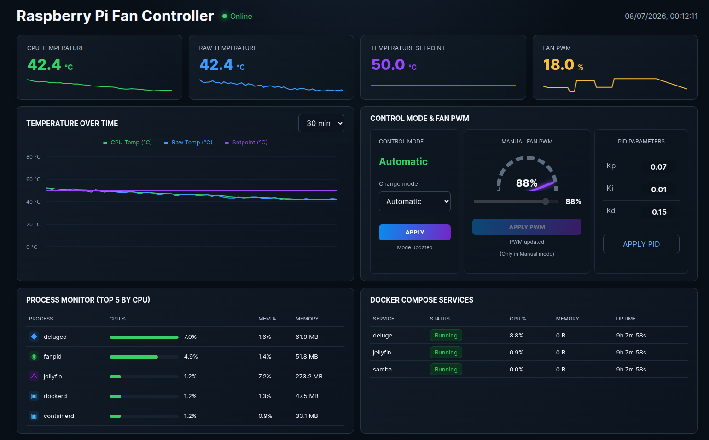

# Raspberry Pi Fan Controller

A configurable PID-based fan controller for Raspberry Pi. It reads the CPU
temperature, smooths short temperature spikes, and controls a PWM fan through a
GPIO pin.

The project provides a fan-control daemon and a responsive web dashboard for
monitoring temperatures, switching between automatic and manual control, and
inspecting host processes and Docker Compose services.



## Features

- **Smart fan control** — PID regulation, moving-average temperature filtering,
  deadband, configurable PWM ramping, and startup kickstart.
- **Flexible operation** — automatic and manual modes with configurable
  temperature targets and PWM limits.
- **Live dashboard** — responsive temperature history, fan status, and control
  interface.
- **System monitoring** — top CPU-consuming processes and Docker Compose service
  resource usage.
- **Simple deployment** — TOML configuration, journal-friendly logging, systemd
  integration, and a typed JSON API with replaceable service implementations.

## Requirements

- Raspberry Pi running Linux
- Python 3.9 or newer
- Python `venv` support (the `python3-venv` package on Raspberry Pi OS)
- PWM-capable fan control circuit
- Docker CLI access (optional, for the Docker Compose services panel)

> [!WARNING]
> Do not connect a bare fan motor directly to a GPIO pin. Use a fan module with
> an integrated driver or a suitable external driver circuit.

## Tested hardware

This project is developed with the
[Argon Mini Fan for Raspberry Pi 4](https://malnapc.hu/custom/malnapc/image/data/docs/RS/A700000007741984.pdf).
The module includes its own controller board and connects directly to the
Raspberry Pi GPIO header.

For software-controlled operation:

1. Power off the Raspberry Pi before installing the fan.
2. Align the fan header with physical pins 1 through 12 as shown in the
   manufacturer's instructions.
3. Make sure the thermal pad and heatsink contact the CPU correctly.
4. Set the fan's hardware mode switch to `PWM`.

The manufacturer's standard configuration also uses **BCM GPIO 18**. This
project controls that pin continuously using software PWM instead of only
switching the fan at a fixed temperature.

The default configuration uses **BCM GPIO 18** at 100 Hz. Adjust these values to
match your wiring and hardware.

## Installation

The included systemd service expects the project at `/opt/fanpid`.

```bash
sudo git clone https://github.com/Adam23713/raspberry-pi-fan-controller.git /opt/fanpid
sudo /opt/fanpid/scripts/install.sh
```

The installer installs the required `python3-venv` and `python3-lgpio` system
packages, creates a Python environment with access to the GPIO backend, installs
the application, enables the systemd service, and starts the controller. An
existing `/opt/fanpid/config/fanpid.toml` file is preserved when the installer
is run again.

Check the service status and follow its logs with:

```bash
sudo systemctl status fanpid
sudo journalctl -u fanpid -f
```

## Web dashboard

The dashboard is available on port `8080` by default:

```text
http://RASPBERRY_PI_IP:8080
```

It shows live temperatures, fan PWM, session history, top CPU-consuming
processes, and Docker Compose service statistics. The fan can be switched
between automatic PID control and manual `0%`–`100%` PWM control. Entering
manual mode always starts at `0%`.

The PID panel is currently display-only; values remain configured in
`config/fanpid.toml`. The Docker panel requires local Docker CLI access and
stays empty when Docker is unavailable.

The dashboard currently has no authentication and includes fan-control
operations. Keep it on a trusted local network and do not expose it directly to
the internet.

## Uninstallation

Remove the service and virtual environment while preserving the source code and
configuration:

```bash
sudo /opt/fanpid/scripts/uninstall.sh
```

To also remove `/opt/fanpid`, including the saved configuration and Git data:

```bash
sudo /opt/fanpid/scripts/uninstall.sh --purge
```

The uninstaller leaves the shared `python3-venv` and `python3-lgpio` system
packages installed.

## Running manually

For development or troubleshooting:

```bash
python3 -m venv .venv
.venv/bin/pip install .
sudo .venv/bin/fanpid --config config/fanpid.toml
```

Press `Ctrl+C` to stop the controller and turn the fan off.

## Configuration

Settings are stored in [`config/fanpid.toml`](config/fanpid.toml).

Duty-cycle values use the range `0.0` to `1.0`. For example, `0.30` means
30% PWM duty cycle. Temperature values are in degrees Celsius, and time values
are in seconds.

After changing the configuration of a systemd installation, restart the
service:

```bash
sudo systemctl restart fanpid
```

## How it works

The controller samples the Raspberry Pi CPU temperature at a fixed interval and
calculates a moving average. Below `fan_off_temp`, the fan is turned off. At or
above `full_speed_temp`, it runs at the configured maximum duty cycle. Between
those limits, the PID controller calculates the requested output.

In manual mode, PID output is bypassed and the requested manual duty is applied
directly. Temperature sampling and status reporting continue in both modes.

When starting from rest, the fan briefly receives `kickstart_duty` before
settling at the calculated speed. This helps fans that cannot start reliably at
a low PWM duty cycle.

## Project structure

```text
fanpid/
├── frontend/
│   ├── app.js       # Dashboard behavior and API integration
│   ├── fanpid.png   # Browser tab icon
│   ├── index.html   # Dashboard markup
│   └── styles.css   # Dashboard styling
├── compose.py       # Docker Compose monitor interface and implementation
├── config.py        # TOML configuration models and loading
├── controller.py    # Main control loop
├── daemon.py        # Dependency wiring and command-line entry point
├── fan.py           # GPIO/PWM fan access
├── pid.py           # PID calculation
├── process.py       # Process monitor interface and psutil implementation
├── service.py       # Fan-control service interface and implementation
├── state.py         # Thread-safe runtime and control state
├── temperature.py   # CPU temperature interface and file-based reader
└── web.py           # FastAPI routes and DTOs

config/fanpid.toml
systemd/fanpid.service
```

## Roadmap

- Safe shutdown and failsafe operation
- Web-based PID configuration
- Persistent historical metrics

## License

This project is licensed under the [MIT License](LICENSE).
